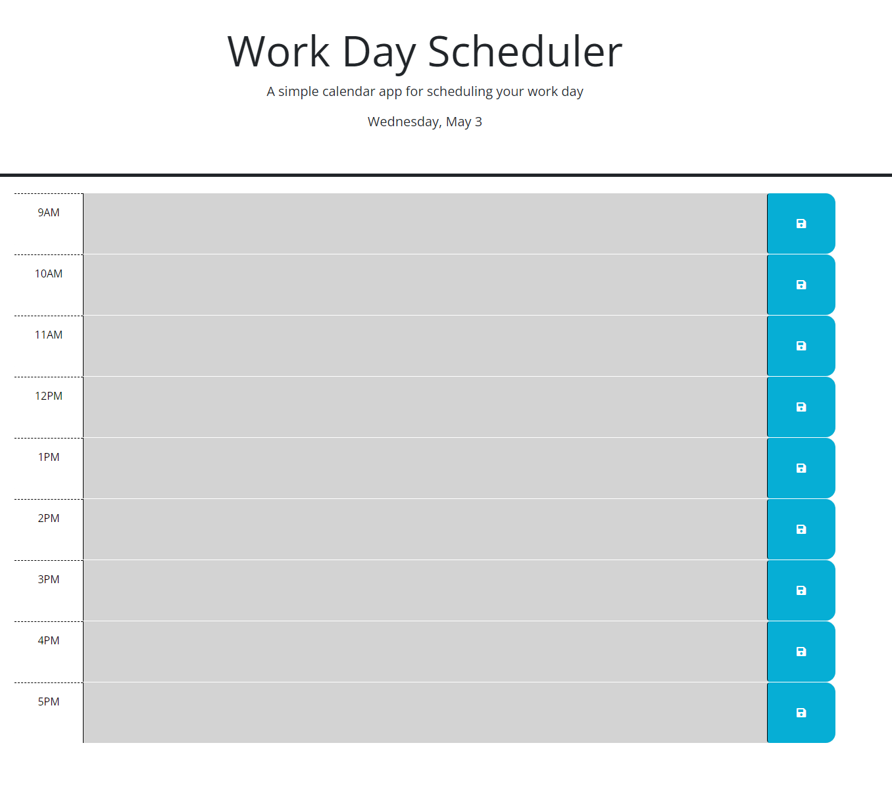
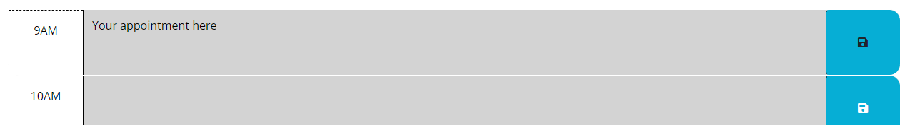

# Challenge #5: Daily Scheduler

## Description

The objective of this project is to deliver in one week a webapp that will help anybody block off their day with in 1-hour chunks. We want to provide a platform where you can save your daily events and appointments in a normal 9-to-5. We intended this to assist you protect your time from the whirlwind of fire fights you randomly deal with in your day-to-day. 

Lesson Learned:
- There are opportunities to optimizing my loops

## Installation

Webapp utilize your web browser already.
No installation neccessary.

## Usage

Navigate to this URL in your preferred browser: <https://19dbo91.github.io/challenge5-daily-scheduler/>

On the left, you will see time of day at 1-hour intervals, starting from 9AM to 5PM.
To the right of the time blocks, you will see colored blocks.

The box immediately to the right is the text area, which you can type your appointments into an track.
This box will also change colors based on whether that time block is:
- Already in the past (grey)
- Currently happening (red)
- Coming up (green)

The blue blocks are 'save' buttons that store your text locally, which allows you to reload the page and show what you had last wrote in last time. 

To clear an text, go to the text and delete them. Then, save it afterwards.

## Credits

STARTER CODE FROM: UCI, Div. of Extd. Studies, Coding Bootcamp

CO-CONSPIRATORS:
Kim Carpenter
Erwin Jocosing

## Features

- Local storage utilization
- Bootstrap
- FontAwesome
- Google Fonts
- JQuery
- DayJS

## Limitations

- No built-in cloud/off-site
- No crossover to another device